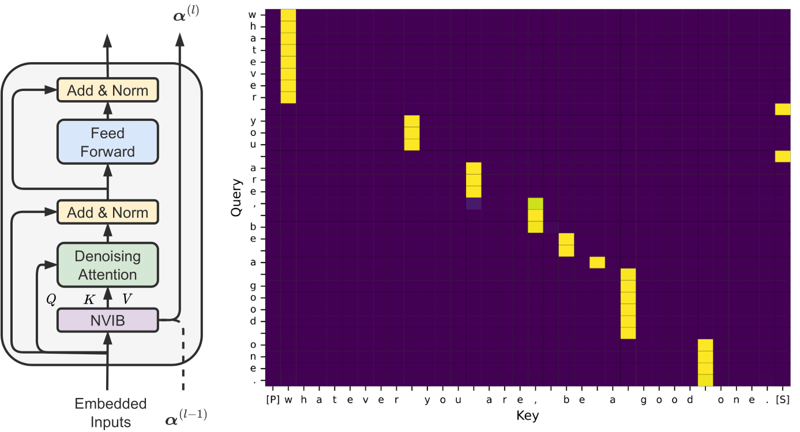

..
.. SPDX-FileCopyrightText: Copyright © 2023 Idiap Research Institute <contact@idiap.ch>
..
.. SPDX-FileContributor: Fabio J Fehr <fabio.fehr@idiap.ch>, Melika Behjati <melika.behjati@idiap.ch>
..
.. SPDX-License-Identifier: GPL-3.0-only
..

================================================================================================================
Learning to Abstract with Nonparametric Variational Information Bottleneck
================================================================================================================
This repository contains the code developed for the paper: `Learning to Abstract with Nonparametric Variational Information Bottleneck <https://aclanthology.org/2023.findings-emnlp.106/>`_

We introduce a novel language representation model which can learn to compress to different levels of abstraction at different layers of the same model. We apply Nonparametric Variational Information Bottleneck (NVIB) to stacked Transformer self-attention layers in the encoder, which encourages an information-theoretic compression of the representations through the model.

Citation
---------

Please cite the original authors for their work in any publication(s) that uses this work:

.. code:: bib

    @inproceedings{behjati2023learning,
    title={Learning to Abstract with Nonparametric Variational Information Bottleneck},
    author={Melika Behjati and Fabio James Fehr and James Henderson},
    booktitle={Findings of the Association for Computational Linguistics: EMNLP 2023},
    year={2023},
    url={https://aclanthology.org/2023.findings-emnlp.106}
    }

Installation
------------

To create a new conda/mamba environment, install conda_, then mamba_, and simply follow the next steps:

.. code:: bash

    mamba env create -f environment.yml   # Create environment
    mamba activate nvib_sa                # Activate environment

*NB* This environment also installs the `nvib package <https://github.com/idiap/nvib>`_ which is assumed to be in a directory one level above the current directory. 

Command-line Usage
-------------------

Here we provide the commandline usage to recreate the experiments in the paper.

Training
~~~~~~~~~~~~~~~~~~~~~~~~~~

The training function for the baseline Transformer and the NVIB model. See the paper for more details on the hyperparameters. You will need to provide your own wandb entity and project name. 
*NB* Running on different hardware may cause slightly different results.

.. code:: bash

    python train.py --experiment_name baseline --project_name nvib_selfattention --entity wandb_entity  --model Transformer --data wikitext --data_subset wikitext-2-raw-v1  --batch_size 512 --num_workers 1 --d_model 512 --nhead 1  --dim_feedforward 512  --num_encoder_layers 6  --num_decoder_layers 2  --dropout 0.1  --learning_rate 0.001 --max_steps 2500 --checkpoint_interval 100 --deletion_prob 0.1  --deletion_type token --lr_scheduler --fp16 --seed 42 

    python train.py --experiment_name nvib --project_name nvib_selfattention --entity wandb_entity --model NVIBSaTransformer --data wikitext --data_subset wikitext-2-raw-v1 --batch_size 512 --num_workers 1 --d_model 512 --nhead 1 --dim_feedforward 512 --num_encoder_layers 3 --num_decoder_layers 2 --dropout 0.1 --learning_rate 0.001 --max_steps 8000 --checkpoint_interval 100 --deletion_prob 0.1 --deletion_type token --lr_scheduler --fp16 --seed 42 --num_nvib_encoder_layers 3 --klg_lambda 0.01 --kld_lambda 1 --delta 0.25 --weighted_kl --kl_annealing_type linear                   

Attention Visualisation
~~~~~~~~~~~~~~~~~~~~~~~~~~

Once trained you can visualise the attention weights of the baseline Transformer or the NVIB model. This will be saved in the directory of the model.

.. code:: bash

    python plots/plot_attention.py --experiment_name baseline --project_name nvib_selfattention --model Transformer --data wikitext --data_subset wikitext-2-raw-v1 --batch_size 512 --num_workers 1 --d_model 512 --nhead 1 --dim_feedforward 512 --num_encoder_layers 6 --num_decoder_layers 2 --dropout 0.1 --max_steps 2500 --deletion_prob 0.1 --deletion_type token --fp16 --seed 42  

    python plots/plot_attention.py --experiment_name nvib --project_name nvib_selfattention --model NVIBSaTransformer --data wikitext --data_subset wikitext-2-raw-v1 --batch_size 512 --num_workers 1 --d_model 512 --nhead 1 --dim_feedforward 512 --num_encoder_layers 3 --num_decoder_layers 2 --dropout 0.1 --max_steps 8000 --deletion_prob 0.1 --deletion_type token --fp16 --seed 42  --num_nvib_encoder_layers 3 --klg_lambda 0.01 --kld_lambda 1 --delta 0.25 --weighted_kl --kl_annealing_type linear

ArXiv Topic Classification
~~~~~~~~~~~~~~~~~~~~~~~~~~
You can evaluate the trained model's performance for the ArXiv topic classification task by specifying the subject and the datsaset size.

.. code:: bash

    python arxiv_evaluation.py --trained_model_name baseline_model --subject cs --dataset_size large --model Transformer --model_dir ../path_to_the_checkpoint

    python arxiv_evaluation.py --trained_model_name nvib_model --subject cs --dataset_size large --model NVIBSaTransformer --model_dir ../path_to_the_checkpoint

SentEval Linguistic Probing
~~~~~~~~~~~~~~~~~~~~~~~~~~
You can evaluate the trained model's performance for the SentEval linguistic probing task by specifying the task and the layer number of the model to probe (i.e. zero indexed).

.. code:: bash

    python senteval_evaluation.py --model Transformer --trained_model_name baseline_model --data_subset bigram_shift --model_dir ../path_to_the_checkpoint --probe_layer_num -1

    python senteval_evaluation.py --model NVIBSaTransformer --trained_model_name nvib_model --data_subset bigram_shift --model_dir ../path_to_the_checkpoint --probe_layer_num -1

Robustness Analysis
~~~~~~~~~~~~~~~~~~~~~~~~~~
You can evaluate the trained model's robustness to different levels of noise. This will output two plots.

.. code:: bash

    python robustness_evaluation.py  --model Transformer --trained_model_name baseline_model --model_dir ../path_to_the_checkpoint

    python robustness_evaluation.py --model NVIBSaTransformer --trained_model_name nvib_model --model_dir ../path_to_the_checkpoint

Segmentation Evaluation
~~~~~~~~~~~~~~~~~~~~~~~~~~
You can evaluate the trained model's word segmentation quality in term of precision, recall and F1.

.. code:: bash

    python segmentation_evaluation.py --model NVIBSaTransformer --trained_model_name nvib_model --model_dir ../path_to_the_checkpoint

    python segmentation_evaluation.py --model Transformer --trained_model_name nvib_model --model_dir ../path_to_the_checkpoint

Repository Structure
-----------------------------

.. code:: bash

    .
    ├── data [to be downloaded]
    │   ├── arxiv
    │   ├── senteval
    │   └── wikitext-2-raw-v1
    ├── data_modules
    │   ├── ArxivDataModule.py
    │   ├── CharizardTokenizer.py
    │   ├── DataCollatorForSeq2SeqWithClassification.py
    │   ├── DataCollatorForSeq2SeqWithNoise.py
    │   ├── PlotReconstructionDataModule.py
    │   ├── ReconstructionDataModule.py
    │   ├── RobustnessDataModule.py
    │   └── SentEvalDataModule.py
    ├── environment.yml
    ├── evaluation
    │   ├── senteval_constants.py
    │   └── probe.py
    ├── figures
    │   ├── NVIBSa.png
    │   └── NVIBSa.png.license
    ├── LICENSES
    │   └── GPL-3.0-only.txt
    ├── models
    │   ├── biased_multihead_attention.py
    │   ├── nvib_sa_transformer_encoder.py
    │   ├── nvib_sa_transformer.py
    │   ├── seq2seq_lightning.py
    │   ├── transformer_decoder.py
    │   ├── transformer_encoder.py
    │   └── transformer.py
    ├── plots
    │   ├── plot_attention.py
    │   ├── plot_robustness_final.py
    │   ├── plot_robustness.py
    │   └── plot_senteval.py
    ├── arxiv_evaluation.py
    ├── environment.yml
    ├── senteval_evaluation.py
    ├── README.rst
    ├── robustness_evaluation.py
    ├── segmentation_evaluation.py
    ├── train.py
    ├── utils.py
    └── validation_evaluation.py

Contact
---------
For questions or reporting issues for this software, please contact the Authors melika.bejahti@idiap.ch and fabio.fehr@idiap.ch.

.. _conda: https://conda.io
.. _mamba: https://mamba.readthedocs.io/en/latest/installation.html#existing-conda-install
